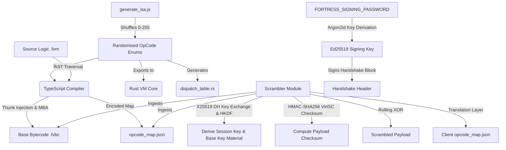
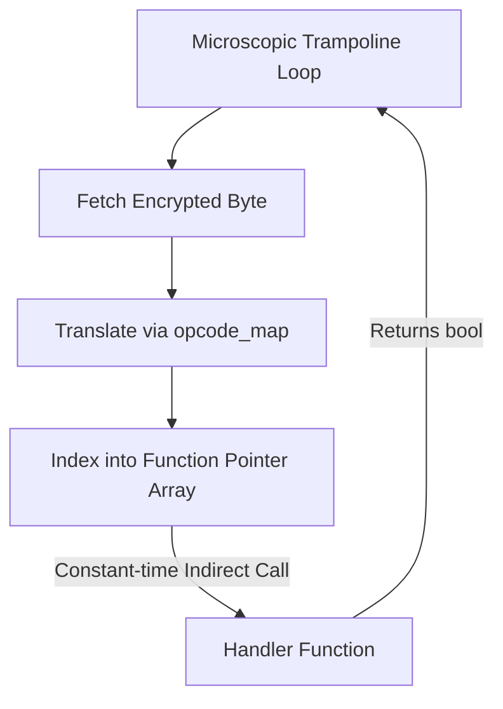
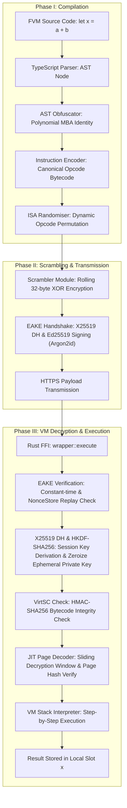

# Fortress WASM Architecture

This document outlines the architectural pillars of the Fortress WASM engine. The system is designed to provide comprehensive defence-in-depth against modern WebAssembly reverse engineering tools, specifically symbolic execution, constraint solvers, and LLM-assisted decompilers.

---

## 1. The Build Pipeline



### Architectural Rationale
The build pipeline enforces **Code Renewability** (Abrath et al., *Code Renewability for Native Software Protection*, arxiv.org/abs/2003.00916). Standard compilers generate a static ISA, allowing attackers to write automated lifters (e.g., mapping `0x20` to `LocalGet`). Fortress WASM breaks this by using a Fisher-Yates shuffle in `generate_isa.js` to randomise the canonical opcode map on every single build. 

Furthermore, the Scrambler generates a secondary translation layer per request. It encrypts the base `.fvbc` payload with a 32-byte rolling XOR key, negotiates the key dynamically using Ephemeral X25519 DH key exchange, verifies the exchange using an Ed25519 signature (derived via Argon2id), checks nonces using a NonceStore to prevent replay attacks, and validates JIT bytecode integrity using HMAC-SHA256. This makes caching, signature matching, and payload diffing mathematically impossible.

---

## 2. Runtime Execution Flow

```mermaid
graph TD
    A[Client Request & Nonce] --> B[Server NonceStore Replay Check]
    B --> C[Receive scrambled.fvbc, Handshake Header, map.json]
    C --> D{Ed25519 Signature Verifier}
    D -->|Verify Signature (Constant-Time subtle::Choice)| E[Extract Ephemeral Keys]
    E -->|X25519 DH & HKDF-SHA256| F[Derive session_key & base_key_material]
    
    F --> G[Initialise VM & Zeroize Private Key]
    G --> H[HMAC-SHA256 VirtSC Check]
    H -->|Match| I[Enter Trampoline Dispatcher]
    H -->|Mismatch| J[Zeroize Sensitive Memory & Fail]
```

### Architectural Rationale
The runtime key negotiation utilizes Ephemeral Authenticated Key Exchange (EAKE) to specifically address static key extraction and eavesdropping vulnerabilities. By negotiating ephemeral keys via X25519 DH and validating them with an Ed25519 signature derived from a server Argon2id password-based key derivation function (with memoryCost: 65536, timeCost: 3, parallelism: 1), we guarantee perfect forward secrecy. Replay protection is enforced via a server-side NonceStore check, validating nonces within a 5-minute replay window. All signature and timestamp validations are executed in constant-time (utilizing the `subtle` crate's constant-time comparison). To further harden client security, sensitive private keys are immediately zeroized in Rust memory as soon as key negotiation completes.

The **VirtSC Checksum Check** (Ahmadvand et al., *VirtSC: Combining Virtualisation Obfuscation with Self-Checksumming*, arxiv.org/abs/1909.11404) guarantees payload integrity via keyed HMAC-SHA256 using the derived `base_key_material`. If an attacker byte-patches the scrambled `.fvbc` file, the pre-execution HMAC-SHA256 checksum check fails, and the VM immediately zeroizes all sensitive memory regions (`base_key_material`, `session_key`, `code`, `ves`, `opcode_map`) to prevent memory-scraping attacks.

---

## 3. JIT Sliding Decryption Window

```mermaid
graph TD
    A[Program Counter Offset] --> B{Crossed 256-Byte Page?}
    B -->|Yes| C[Clear Previous Page Plaintext]
    C --> D[Calculate New XOR Offset]
    D --> E[Decrypt New Page with Session Key]
    E --> F[Compute Page SHA-256 Hash]
    F --> G{Hash matches expected?}
    G -->|Yes| H[Execute]
    G -->|No| I[Corrupt session_key[0] via XORing 0xFF]
    I --> H
    B -->|No| H
```

### Architectural Rationale
A standard defence against packed or encrypted binaries is a runtime memory dump—waiting until the VM decrypts the payload and scraping the raw memory. To defeat this, Fortress WASM uses a **Sliding Decryption Window** combined with dynamic page hashing verification.

The bytecode is conceptually divided into 256-byte pages. As the Virtual Program Counter (VPC) advances, the VM decrypts only the current page in a highly localised buffer using the rolling 32-byte XOR session key. When execution crosses a page boundary, the previous plaintext is explicitly cleared from memory. At any given instant, a maximum of 256 bytes is exposed, rendering bulk memory dumping useless.

Furthermore, upon decrypting a page, the VM computes its SHA-256 hash and compares it with the expected page hash. If a hash mismatch is detected (indicating dynamic memory tampering or injection), the VM corrupts the session key by XORing `session_key[0]` with `0xFF`. Subsequent decryptions will then decode garbage instructions, resulting in a silent execution crash.

---

## 4. Function Pointer Dispatch Table



### Architectural Rationale
The traditional `switch-case` or `match` block is the universal structural fingerprint of a virtual machine. Static LLVM IR analysis tools (e.g., Authors of Static VM Detection, *Static Detection of Core Structures in Tigress Virtualisation-Based Obfuscation Using an LLVM Pass*, arxiv.org/abs/2601.12916) easily identify dispatchers by searching for the basic block with the highest number of successors.

To utterly destroy this heuristic, we decentralised the dispatcher. The `generate_isa.js` script dynamically emits a flat, 256-element array of function pointers (`dispatch_table.rs`) mapping every randomised opcode byte to a statically isolated handler. The central loop is reduced to a microscopic trampoline that simply indexes into this array and performs an indirect call. The switch block no longer exists in the compiled binary.

---

## 5. End-to-End Variable Lifecycle Data Flow



### Architectural Rationale
This fifth diagram outlines the entire lifecycle of a variable data flow under virtualisation. It illustrates how the high-level semantic logic is systematically decomposed, obfuscated algebraically, encrypted cryptographically, negotiated via an ephemeral authenticated key exchange, verified, checked for bytecode integrity, decrypted via a sliding window with page-hash checks, and executed incrementally on a stack machine. This process ensures that the variable's true mathematical value is never exposed in a plain or unprotected format at any point during its transit or execution in the browser memory.
