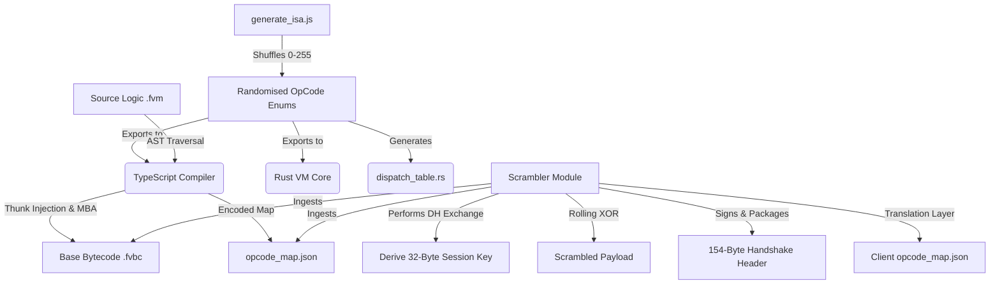
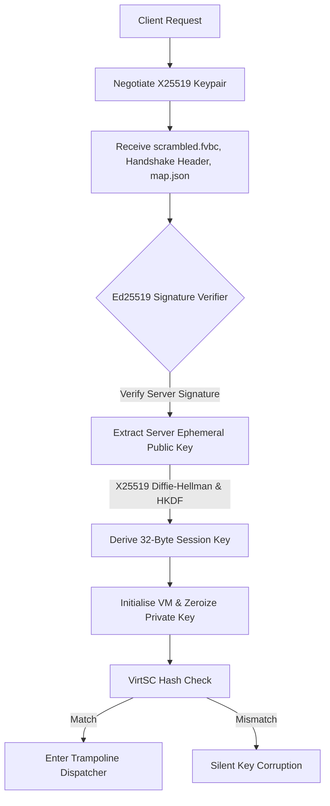
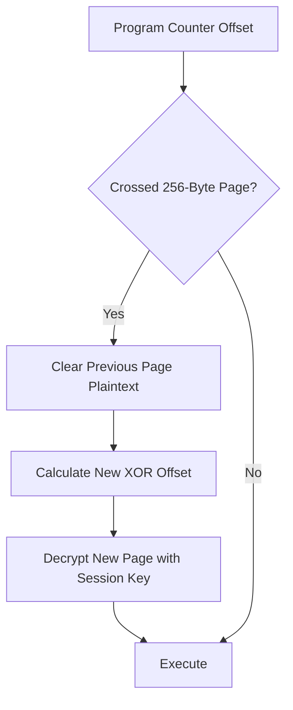
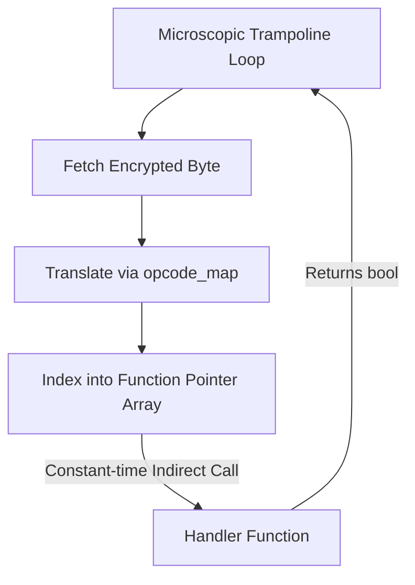
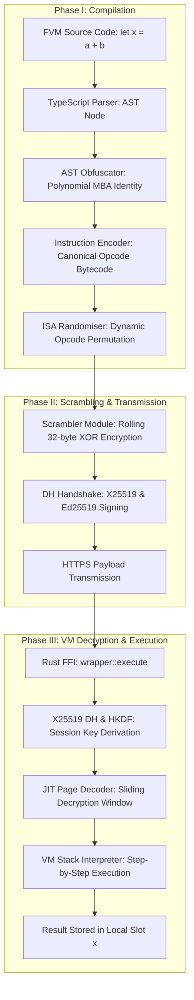

# Fortress WASM Architecture

This document outlines the architectural pillars of the Fortress WASM engine. The system is designed to provide comprehensive defence-in-depth against modern WebAssembly reverse engineering tools, specifically symbolic execution, constraint solvers, and LLM-assisted decompilers.

---

## 1. The Build Pipeline

### Architectural Rationale
The build pipeline enforces **Code Renewability** (Abrath et al., *Code Renewability for Native Software Protection*, arxiv.org/abs/2003.00916). Standard compilers generate a static ISA, allowing attackers to write automated lifters (e.g., mapping `0x20` to `LocalGet`). Fortress WASM breaks this by using a Fisher-Yates shuffle in `generate_isa.js` to randomise the canonical opcode map on every single build. 

Furthermore, the Scrambler generates a secondary translation layer per request. It encrypts the base `.fvbc` payload with a 32-byte rolling XOR key, negotiates the key dynamically using an ephemeral X25519 DH key exchange signed by an Ed25519 signature, and generates a fresh runtime mapping. This makes caching, signature matching, and payload diffing mathematically impossible.

---

## 2. Runtime Execution Flow

### Architectural Rationale
The runtime key negotiation specifically addresses static key extraction and eavesdropping vulnerabilities. By negotiating an ephemeral 32-byte session key via X25519 Diffie-Hellman and validating the parameters with a server-signed Ed25519 signature, we guarantee perfect forward secrecy and protect against man-in-the-middle or replay attacks. To further harden client security, the client private key is immediately zeroized in Rust memory as soon as the session key is negotiated.

The **VirtSC Hash Check** (Ahmadvand et al., *VirtSC: Combining Virtualisation Obfuscation with Self-Checksumming*, arxiv.org/abs/1909.11404) guarantees payload integrity. If an attacker byte-patches the scrambled `.fvbc` file to inject malicious instructions or alter control flow, the pre-execution SHA-256 hash check fails. Rather than throwing an overt error—which an attacker could trace and bypass—it silently corrupts the 32-byte session key. When the JIT decryption window reaches the patched section, it decrypts garbage opcodes, causing a silent and untraceable crash.

---

## 3. JIT Sliding Decryption Window

### Architectural Rationale
A standard defence against packed or encrypted binaries is a runtime memory dump—waiting until the VM decrypts the payload and scraping the raw memory. To defeat this, Fortress WASM uses a **Sliding Decryption Window**.

The bytecode is conceptually divided into 256-byte pages. As the Virtual Program Counter (VPC) advances, the VM decrypts only the current page in a highly localised buffer using the rolling 32-byte XOR session key. When execution crosses a page boundary, the previous plaintext is explicitly cleared from memory. At any given instant, a maximum of 256 bytes is exposed, rendering bulk memory dumping useless.

---

## 4. Function Pointer Dispatch Table

### Architectural Rationale
The traditional `switch-case` or `match` block is the universal structural fingerprint of a virtual machine. Static LLVM IR analysis tools (e.g., Authors of Static VM Detection, *Static Detection of Core Structures in Tigress Virtualisation-Based Obfuscation Using an LLVM Pass*, arxiv.org/abs/2601.12916) easily identify dispatchers by searching for the basic block with the highest number of successors.

To utterly destroy this heuristic, we decentralised the dispatcher. The `generate_isa.js` script dynamically emits a flat, 256-element array of function pointers (`dispatch_table.rs`) mapping every randomised opcode byte to a statically isolated handler. The central loop is reduced to a microscopic trampoline that simply indexes into this array and performs an indirect call. The switch block no longer exists in the compiled binary.

---

## 5. End-to-End Variable Lifecycle Data Flow

### Architectural Rationale
This fifth diagram outlines the entire lifecycle of a variable data flow under virtualisation. It illustrates how the high-level semantic logic is systematically decomposed, obfuscated algebraically, encrypted cryptographically, negotiated via an ephemeral authenticated key exchange, and executed incrementally on a stack machine. This process ensures that the variable's true mathematical value is never exposed in a plain or unprotected format at any point during its transit or execution in the browser memory.
