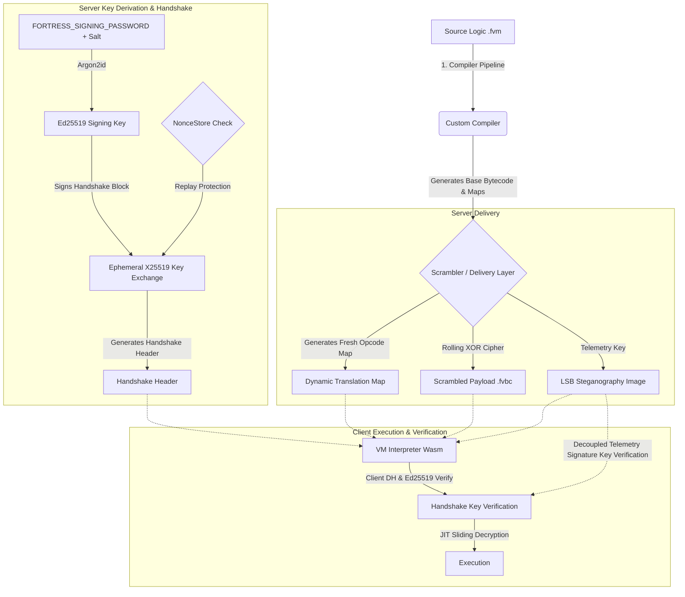

# Fortress WASM

I built proprietary software for a client—a complex coaching dashboard with significant, high-value business logic embedded directly in it. When the client relationship deteriorated, I found myself in a position where they had the financial resources and the motivation to simply hire someone to reverse engineer my compiled WebAssembly, extract my proprietary logic, and replicate the core system without my involvement. That isn't a hypothetical threat model; it was a real, immediate risk to my intellectual property. 

I needed to make that mathematically and practically as difficult as possible. Standard WebAssembly is essentially human-readable. It has a highly structured AST and lacks the hardware-level obscurity of native binaries. If you deploy your proprietary logic in standard Wasm, you are effectively open-sourcing it. This project is my answer to that problem. I built this at 4am because I was genuinely obsessed with getting it right, and I've cleaned it up to share.

Fortress WASM serves both as a passively hardened virtual machine and as the foundational runtime substrate for an active Runtime Application Self-Protection (RASP) layer, capable of actively defending client-side logic against host-based tampering, dynamic extraction, and automated deobfuscation.

---

## 📚 Documentation Index

For detailed guides and reference documentation, please see the following guides:

- ⚙️ **[Configuration Guide](docs/config.md)**: Options and settings for `fortress.config.js`.
- 💻 **[Command Line Interface (CLI) Guide](docs/cli.md)**: Compilation, live-watch (`dev` mode with port conflict solver), and integrity auditing (`verify` command).
- 🔄 **[JS-to-FVM Transpiler Guide](docs/transpiler.md)**: Details on syntax compatibility, helper function maps, stable merge sorting, and error boundaries.
- 🛡️ **[Security Model & Hardening Guide](docs/security-model.md)**: Deep dive into the Ed25519/X25519 key exchanges, steganography carrier, rolling XOR, and the 13 academic hardening phases.
- 🔌 **[Framework Integrations & CSP Guide](docs/frameworks.md)**: Outlining hooks/middleware setup and required Content Security Policy (`worker-src 'self' blob:;`) directives.

---

## How It Works

Fortress WASM is not a simple obfuscator; it's a three-layer execution engine that mathematically isolates your logic from the host environment. 



The system separates the compilation of canonical opcodes from their runtime execution. The **Compiler Pipeline** translates high-level code into a custom, non-standard ISA that is randomised on every build. The **Scrambler Layer** intercepts the payload on the server, encrypts it, generates a totally fresh translation map for that specific session, and hides the 32-byte cryptographic session key inside a PNG image using a dynamically derived LSB stride. The **VM Interpreter** runs in the browser, extracts the key, and uses a JIT sliding decryption window to execute the logic without the payload ever residing fully decrypted in memory.

---

## Building and Running

You need Node.js and Rust installed (`wasm-pack`). 

```bash
# 1. Install dependencies
npm install

# 2. Build the entire pipeline for development
FORTRESS_SIGNING_PASSWORD=validpassword123 npm run build:dev

# 3. Build the entire pipeline for production (enforces steganographic key requirements)
FORTRESS_SIGNING_PASSWORD=validpassword123 npm run build:prod

# 4. Compile a sample script
node compiler/dist/cli.js path/to/script.fvm

# 5. Scramble the payload for delivery (generates unique .fvbc, map, and key.png)
node server/dist/scrambler.js path/to/script.fvbc path/to/script.opcodes.json
```

## Running Tests

The verification pipeline tests functional correctness and renewability in both environments.

```bash
# Run unit and integration tests (both Rust and TS)
FORTRESS_SIGNING_PASSWORD=validpassword123 npm run test:full

# Run E2E integration test suite
FORTRESS_SIGNING_PASSWORD=validpassword123 npm run test:e2e
```

Refer to [docs/cli.md](docs/cli.md) and [docs/transpiler.md](docs/transpiler.md) for detailed descriptions of test commands and transpiler behavior.

---

## Subresource Integrity (SRI)

To prevent supply chain attacks and guarantee runtime integrity, Fortress WASM generates SHA-384 hashes for its compiled WebAssembly binaries. These hashes allow hosts and browsers to verify that the compiled code has not been tampered with.

The hashes are generated automatically during the build process:
- When running `npm run build` (or `build:dev` / `build:prod`), the build script automatically executes `node scripts/build.js --only-hashes` to generate:
  - `pkg-web/vm_core_bg.wasm.sha384` (for the web target)
  - `pkg-node/vm_core_bg.wasm.sha384` (for the Node.js target)
- The build pipeline and CI workflow (`.github/workflows/publish.yml`) incorporate reproducible builds via `npm ci`, block copyleft licenses via `cargo-deny`, run security audits via `npm audit` and `cargo-audit`, and automatically write the computed Web WASM SHA-384 hash to `WASM_INTEGRITY.txt` at the root of the workspace.

---

## References

1. Robert Vähhi / TrustSig — *Building a Wasm-in-Wasm Virtualizer (with JIT Decrypted Paged Memory)* (2026) — trustsig.eu/blog/wasm-vm
2. Cao et al. — *WASMixer: Binary Obfuscation for WebAssembly* (2023) — arxiv.org/abs/2308.03123
3. Harnes & Morrison — *Cryptic Bytes: WebAssembly Obfuscation for Evading Cryptojacking Detection* (NTNU, 2024) — arxiv.org/abs/2403.15197
4. Harnes & Morrison — *SoK: Analysis Techniques for WebAssembly* (NTNU, 2024) — arxiv.org/abs/2401.05943
5. Liu et al. — *MBA-Blast: Unveiling and Simplifying Mixed Boolean-Arithmetic Obfuscation* (USENIX Security 2021) — usenix.org/conference/usenixsecurity21/presentation/liu-binbin
6. Reichenwallner et al. — *SiMBA: Efficient Deobfuscation of Linear Mixed Boolean-Arithmetic Expressions* (2022) — arxiv.org/abs/2209.06335
7. Roh, Paik, Kwon & Cho — *gMBA: Expression Semantic Guided Mixed Boolean-Arithmetic Deobfuscation Using Transformer Architectures* (ACL 2025) — arxiv.org/abs/2506.23634
8. Authors of PUSHAN — *Pushan: Trace-Free Deobfuscation of Virtualisation-Obfuscated Binaries* (2026) — arxiv.org/abs/2603.18355
9. Zou et al. — *XuanJia: A Comprehensive Virtualisation-Based Code Obfuscator for Binary Protection* (2026) — arxiv.org/abs/2601.10261
10. Ahmadvand et al. — *VirtSC: Combining Virtualisation Obfuscation with Self-Checksumming* (2019) — arxiv.org/abs/1909.11404
11. Authors of WasmWalker — *WasmWalker: Path-based Code Representations for Improved WebAssembly Program Analysis* (2024) — arxiv.org/abs/2410.08517
12. Authors of Wasm Decompilation Study — *Is This the Same Code? A Comprehensive Study of Decompilation Techniques for WebAssembly Binaries* (2024) — arxiv.org/abs/2411.02278
13. Schloegel et al. — *Loki: Hardening Code Obfuscation Against Automated Attacks* (USENIX Security 2022) — arxiv.org/abs/2106.08913
14. Authors of Static VM Detection — *Static Detection of Core Structures in Tigress Virtualisation-Based Obfuscation Using an LLVM Pass* (2026) — arxiv.org/abs/2601.12916
15. Fang, Zhou, He & Wang — *StackSight: Unveiling WebAssembly through Large Language Models and Neurosymbolic Chain-of-Thought Decompilation* (ICML 2024) — arxiv.org/abs/2406.04568
16. Abrath et al. — *Code Renewability for Native Software Protection* (Ghent University, 2020) — arxiv.org/abs/2003.00916
17. Tim Blazytko & Nicolò Altamura — *Breaking Mixed Boolean-Arithmetic Obfuscation in Real-World Applications* (Recon 2025) — recon.cx/cfp.recon.cx/recon-2025/talk/BKBQ37/index.html

---

**Built by Luke Eldridge**
[@system on Instagram](https://instagram.com/system)
