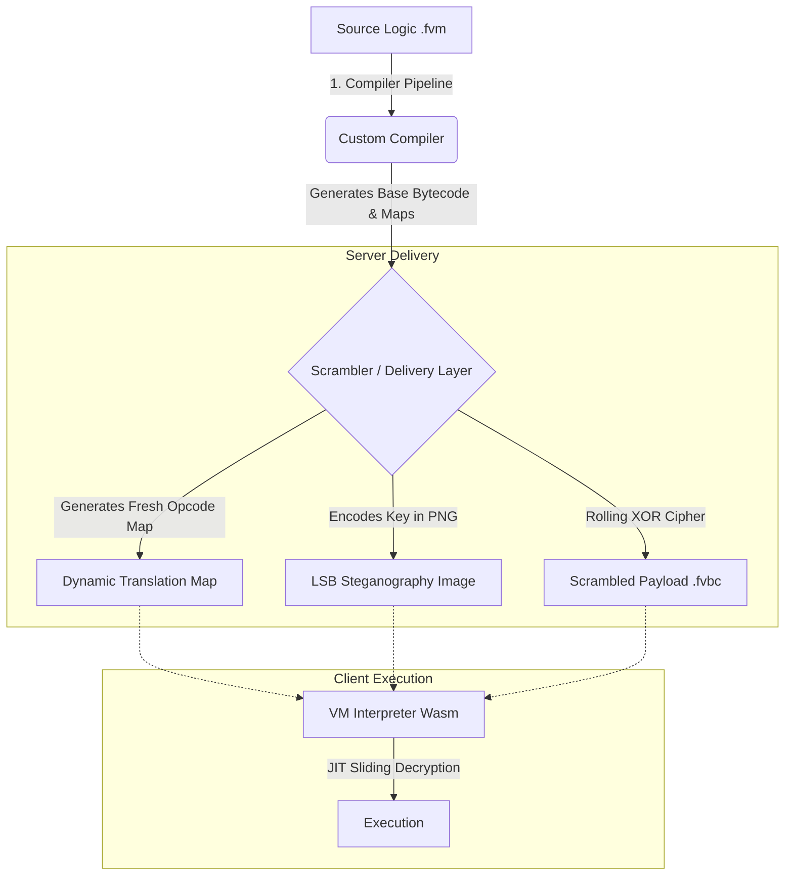

# Fortress WASM

I built proprietary software for a client—a complex coaching dashboard with significant, high-value business logic embedded directly in it. When the client relationship deteriorated, I found myself in a position where they had the financial resources and the motivation to simply hire someone to reverse engineer my compiled WebAssembly, extract my proprietary logic, and replicate the core system without my involvement. That isn't a hypothetical threat model; it was a real, immediate risk to my intellectual property. 

I needed to make that mathematically and practically as difficult as possible. Standard WebAssembly is essentially human-readable. It has a highly structured AST and lacks the hardware-level obscurity of native binaries. If you deploy your proprietary logic in standard Wasm, you are effectively open-sourcing it. This project is my answer to that problem. I built this at 4am because I was genuinely obsessed with getting it right, and I've cleaned it up to share.

Fortress WASM serves both as a passively hardened virtual machine and as the foundational runtime substrate for an active Runtime Application Self-Protection (RASP) layer, capable of actively defending client-side logic against host-based tampering, dynamic extraction, and automated deobfuscation.

## The Approach

I didn't want to build security theatre, so I started with the academic literature. The foundation of this system is a Wasm-in-Wasm virtualisation concept outlined by Robert Vähhi at TrustSig. From there, I went deep into offensive research. I read seventeen academic papers covering every major attack methodology currently used against WebAssembly binaries. I read *PUSHAN* to understand the state of the art in VM deobfuscation. I read *SiMBA* and *MBA-Blast* to see which Mixed Boolean-Arithmetic patterns are already broken by solvers. I read *WasmWalker* to understand how machine learning classifiers fingerprint binaries, and *StackSight* to understand how LLMs use chain-of-thought to decompile them. 

Then, I systematically built countermeasures against each one by name. This repository represents thirteen phases of hardening. Every major attack in the current literature has a named, implemented defence built into this engine.

## How It Works

Fortress WASM is not a simple obfuscator; it's a three-layer execution engine that mathematically isolates your logic from the host environment. 



The system separates the compilation of canonical opcodes from their runtime execution. The **Compiler Pipeline** translates high-level code into a custom, non-standard ISA that is randomised on every build. The **Scrambler Layer** intercepts the payload on the server, encrypts it, generates a totally fresh translation map for that specific session, and hides the 32-byte cryptographic session key inside a PNG image using a dynamically derived LSB stride. The **VM Interpreter** runs in the browser, extracts the key, and uses a JIT sliding decryption window to execute the logic without the payload ever residing fully decrypted in memory.

## Security Model

This system implements targeted defences against the following state-of-the-art attack vectors:

| Hardening Phase | Attack / Vulnerability | Defeated By | Countermeasure Implementation | Reference |
|---|---|---|---|---|
| **Phase 1** | Plaintext Constant Leakage | Constant Pool Elimination | On-demand constant decryption via inline nonces | Cao et al. (WASMixer) |
| **Phase 2** | Trivial Disassembly / Lifters | Linear MBA Solvers | Mixed Boolean-Arithmetic substitution (Add/Sub) | Harnes & Morrison (Cryptic Bytes) |
| **Phase 3** | Symbolic Execution Paths | Path Explosion Tools | Bogus control flow injection & opaque predicates | Cao et al. (WASMixer) |
| **Phase 4** | Static Key Ingestion | Hardcoded Key Extractors | LSB steganographic key delivery with dynamic strides | Steganographic Key Delivery |
| **Phase 5** | Emulation / Emulators | VPC Emulators (e.g. PUSHAN) | VPC program counter base/offset fragmentation | Authors of PUSHAN |
| **Phase 6** | Algebraic Deobfuscators | SMT Solvers (SiMBA, MBA-Blast) | Polynomial non-linear MBA and pseudo-variable domain expansion | MBA-Blast, SiMBA, gMBA |
| **Phase 7** | ML Classifier Profiling | Static AST Fingerprinters | AST Path Distribution Pollution (semantically valid dead blocks) | Authors of WasmWalker |
| **Phase 8** | Monolithic Dispatcher Fingerprints | VM Struct Detectors | Dispatcher decentralisation & handler duplication | Authors of PUSHAN |
| **Phase 9** | String Cipher Brute-Force | 1-Byte Key Scrapers | String encryption key hardening (4-byte nonce + 32-byte key) | Key Hardening |
| **Phase 10** | Handler SMT Isolation | Automated Program Synthesis | Superoperator fusion of stack and control flow logic | Schloegel et al. (Loki) |
| **Phase 11** | Neurosymbolic CoT Extraction | LLM Decompilers (StackSight) | LLM Stack Poisoning via non-monotonic phantom stack spikes | Fang et al. (StackSight) |
| **Phase 12** | Differential Payload Auditing | Signature Cache & Differs | Per-request Code Renewability (map, key & stride reshuffling) | Abrath et al. (Code Renewability) |
| **Phase 13** | Dispatcher Succession Heuristics | LLVM Switch Profilers | switch-block elimination via native Function Pointer Trampoline | Static VM Detection |

For a totally honest assessment of what this protects against, what it doesn't, and my threat model assumptions, see [SECURITY.md](SECURITY.md).

## Engine Architecture

For a detailed breakdown of the compilation pipeline stages, the runtime VM execution flow, and the JIT sliding decryption window, see [ARCHITECTURE.md](ARCHITECTURE.md). The step-by-step variable lifecycle trace and stack execution state under polynomial MBA transformations are mapped in [FLOW_MAPPING.md](FLOW_MAPPING.md).

## Building and Running

You need Node.js and Rust installed (`wasm-pack`). 

```bash
# 1. Install dependencies
npm install

# 2. Build the entire pipeline for development
npm run build:dev

# 3. Build the entire pipeline for production (enforces steganographic key requirements)
npm run build:prod

# 4. Compile a sample script
node compiler/dist/cli.js path/to/script.fvm

# 5. Scramble the payload for delivery (generates unique .fvbc, map, and key.png)
node server/dist/scrambler.js path/to/script.fvbc path/to/script.opcodes.json
```

## Running Tests

The verification pipeline tests functional correctness and renewability in both environments. For a detailed breakdown of the test categories (Tiers 1–4) and the test coverage design, see [TEST_INFRA.md](TEST_INFRA.md).

```bash
# Run unit and integration tests (both Rust and TS)
npm run test:full

# Run E2E integration test suite
npm run test:e2e
```

## Research Document

The complete research methodology, including the threat model, the detailed architecture, the verification results, and exactly how each of the 13 hardening phases was implemented to defeat the academic literature, is fully documented in [RESEARCH.md](RESEARCH.md).

## Contributing

For guidelines on environment setup, building, testing, reporting issues, and opening pull requests, please refer to [CONTRIBUTING.md](CONTRIBUTING.md).

## References

---

**Built by Luke Eldridge**
[@system on Instagram](https://instagram.com/system)

---

1. Robert Vähhi / TrustSig — *Building a Wasm-in-Wasm Virtualizer (with JIT Decrypted Paged Memory)* (2026) — trustsig.eu/blog/wasm-vm
2. Cao et al. — *WASMixer: Binary Obfuscation for WebAssembly* (2023) — arxiv.org/abs/2308.03123
3. Harnes & Morrison — *Cryptic Bytes: WebAssembly Obfuscation for Evading Cryptojacking Detection* (NTNU, 2024) — arxiv.org/abs/2403.15197
4. Harnes & Morrison — *SoK: Analysis Techniques for WebAssembly* (NTNU, 2024) — arxiv.org/abs/2401.05943
5. Liu et al. — *MBA-Blast: Unveiling and Simplifying Mixed Boolean-Arithmetic Obfuscation* (USENIX Security 2021) — usenix.org/conference/usenixsecurity21/presentation/liu-binbin
6. Reichenwallner et al. — *SiMBA: Efficient Deobfuscation of Linear Mixed Boolean-Arithmetic Expressions* (2022) — arxiv.org/abs/2209.06335
7. Roh, Paik, Kwon & Cho — *gMBA: Expression Semantic Guided Mixed Boolean-Arithmetic Deobfuscation Using Transformer Architectures* (ACL 2025) — arxiv.org/abs/2506.23634
8. Authors of PUSHAN — *Pushan: Trace-Free Deobfuscation of Virtualisation-Obfuscated Binaries* (2026) — arxiv.org/abs/2603.18355
9. Zou et al. — *XuanJia: A Comprehensive Virtualisation-Based Code Obfuscator for Binary Protection* (2026) — arxiv.org/abs/2601.10261
10. Ahmadvand et al. — *VirtSC: Combining Virtualisation Obfuscation with Self-Checksumming* (2019) — arxiv.org/abs/1909.11404
11. Authors of WasmWalker — *WasmWalker: Path-based Code Representations for Improved WebAssembly Program Analysis* (2024) — arxiv.org/abs/2410.08517
12. Authors of Wasm Decompilation Study — *Is This the Same Code? A Comprehensive Study of Decompilation Techniques for WebAssembly Binaries* (2024) — arxiv.org/abs/2411.02278
13. Schloegel et al. — *Loki: Hardening Code Obfuscation Against Automated Attacks* (USENIX Security 2022) — arxiv.org/abs/2106.08913
14. Authors of Static VM Detection — *Static Detection of Core Structures in Tigress Virtualisation-Based Obfuscation Using an LLVM Pass* (2026) — arxiv.org/abs/2601.12916
15. Fang, Zhou, He & Wang — *StackSight: Unveiling WebAssembly through Large Language Models and Neurosymbolic Chain-of-Thought Decompilation* (ICML 2024) — arxiv.org/abs/2406.04568
16. Abrath et al. — *Code Renewability for Native Software Protection* (Ghent University, 2020) — arxiv.org/abs/2003.00916
17. Tim Blazytko & Nicolò Altamura — *Breaking Mixed Boolean-Arithmetic Obfuscation in Real-World Applications* (Recon 2025) — recon.cx/cfp.recon.cx/recon-2025/talk/BKBQ37/index.html
